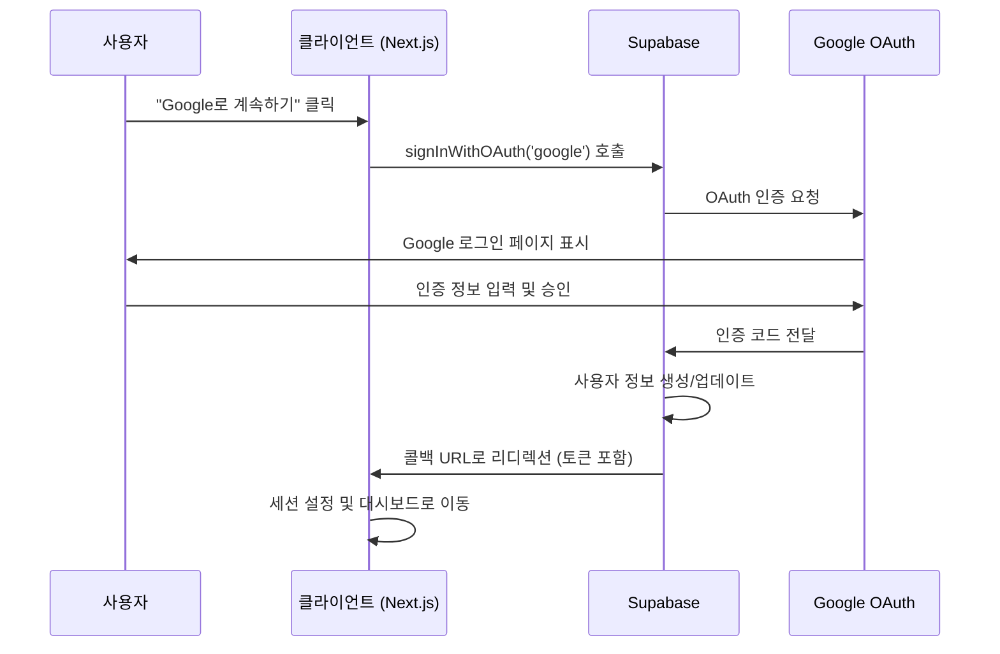

# 구글 로그인 기능 설계 문서

## 개요

ClickNote는 교사들이 학생 관찰 기록을 쉽게 남길 수 있는 애플리케이션입니다. 현재 존재하는 인증 관련 코드들이 제대로 작동하지 않으므로, 완전히 작동하는 구글 OAuth 인증 시스템을 구현하여 교사들이 간편하게 로그인할 수 있도록 합니다.

### 프로젝트 컨텍스트

- **도메인**: 학생 관찰 기록 시스템 (교사용)
- **핵심 목표**: 3클릭 이하로 빠른 기록 작성
- **사용자**: 교사 (바쁜 수업 시간 중 사용)
- **기술 스택**: Next.js (App Router), React, TypeScript, Supabase, Tailwind CSS

### 현재 상태 분석

- **기존 구성요소**: Supabase 클라이언트, OAuth 버튼 컴포넌트, 로그인 페이지가 존재
- **문제점**: 기존 인증 시스템이 작동하지 않음
- **아키텍처**: 모노레포 구조 (web/, mobile/, packages/)

## 아키텍처

### 전체 인증 플로우



### 컴포넌트 구조

```
web/
├── app/
│   ├── auth/
│   │   ├── login/page.tsx          # 로그인 페이지 (수정)
│   │   ├── callback/page.tsx       # OAuth 콜백 처리 (신규)
│   │   └── error/page.tsx          # 인증 오류 페이지 (신규)
│   └── dashboard/                  # 인증 후 랜딩 페이지
├── components/
│   ├── oauth-buttons.tsx           # OAuth 버튼 (수정)
│   └── auth-provider.tsx           # 인증 컨텍스트 (수정)
├── lib/
│   └── supabase.ts                 # Supabase 클라이언트 (수정)
└── middleware.ts                   # 라우팅 미들웨어 (수정)
```

## 컴포넌트 및 인터페이스

### 1. Supabase 클라이언트 설정

**파일**: `web/lib/supabase.ts`

**주요 변경사항**:
- 환경 변수 기반 설정으로 변경
- 브라우저 클라이언트 최적화
- 서버 사이드 클라이언트 분리
- 세션 관리 설정 개선

**핵심 기능**:
```typescript
// 브라우저 클라이언트 - OAuth 인증용
export const createBrowserClient = () => {
  return createClient(supabaseUrl, supabaseAnonKey, {
    auth: {
      persistSession: true,
      autoRefreshToken: true,
      detectSessionInUrl: true,
      flowType: 'pkce'
    }
  });
};
```

### 2. OAuth 버튼 컴포넌트

**파일**: `web/components/oauth-buttons.tsx`

**설계 원칙**:
- 프로젝트 코딩 스타일 준수 (TypeScript, 함수형 컴포넌트)
- Tailwind CSS 사용 (모바일 우선 반응형)
- 교사 사용자를 위한 직관적 UI
- 3클릭 이하 목표에 맞는 간단한 인터페이스

**주요 개선사항**:
- 명시적 타입 정의 (TypeScript 인터페이스)
- 오류 처리 강화 및 사용자 친화적 메시지
- 로딩 상태 시각적 피드백
- 접근성 (a11y) 고려사항 적용

**컴포넌트 구조**:
```typescript
interface OAuthButtonsProps {
  /** 로그인 성공 후 리디렉션할 경로 */
  redirectTo?: string;
  /** 버튼 크기 변형 */
  size?: 'sm' | 'md' | 'lg';
}

export function OAuthButtons({ 
  redirectTo = '/dashboard',
  size = 'md' 
}: OAuthButtonsProps) {
  const [isLoading, setIsLoading] = useState<Provider | null>(null);
  const [error, setError] = useState<string | null>(null);
  
  const handleOAuthSignIn = async (provider: Provider) => {
    setIsLoading(provider);
    setError(null);
    
    try {
      const { error } = await supabase.auth.signInWithOAuth({
        provider,
        options: {
          redirectTo: `${window.location.origin}/auth/callback?next=${redirectTo}`,
          queryParams: {
            access_type: 'offline',
            prompt: 'consent',
          }
        },
      });
      if (error) throw error;
    } catch (error) {
      setError('로그인 중 오류가 발생했습니다. 다시 시도해주세요.');
      console.error(`${provider} OAuth 오류:`, error);
    } finally {
      setIsLoading(null);
    }
  };
  
  // JSX 반환...
}
```

### 3. OAuth 콜백 처리

**파일**: `web/app/auth/callback/page.tsx` (신규)

**설계 원칙**:
- Next.js App Router 패턴 준수
- 서버 컴포넌트와 클라이언트 컴포넌트 적절한 분리
- 교사 사용자 경험 최적화 (빠른 로딩, 명확한 피드백)

**컴포넌트 구조**:
```typescript
'use client';

import { useEffect, useState } from 'react';
import { useRouter, useSearchParams } from 'next/navigation';
import { createBrowserClient } from '@/lib/supabase';

interface CallbackState {
  status: 'loading' | 'success' | 'error';
  message?: string;
}

export default function AuthCallback() {
  const router = useRouter();
  const searchParams = useSearchParams();
  const [state, setState] = useState<CallbackState>({ status: 'loading' });
  
  useEffect(() => {
    const handleCallback = async () => {
      try {
        const supabase = createBrowserClient();
        const { data, error } = await supabase.auth.getSession();
        
        if (error) throw error;
        
        if (data.session) {
          const redirectTo = searchParams.get('next') || '/dashboard';
          setState({ status: 'success', message: '로그인 성공! 잠시만 기다려주세요...' });
          router.push(redirectTo);
        } else {
          throw new Error('세션을 찾을 수 없습니다.');
        }
      } catch (error) {
        console.error('OAuth 콜백 오류:', error);
        setState({ 
          status: 'error', 
          message: '로그인 처리 중 오류가 발생했습니다.' 
        });
        // 3초 후 로그인 페이지로 리디렉션
        setTimeout(() => router.push('/auth/login'), 3000);
      }
    };
    
    handleCallback();
  }, [router, searchParams]);
  
  // 로딩/성공/오류 상태별 UI 렌더링
}
```

### 4. 인증 컨텍스트 개선

**파일**: `web/components/auth-provider.tsx`

**설계 원칙**:
- React Context API 사용 (프로젝트 상태 관리 가이드라인 준수)
- 교사 사용자 경험 최적화 (빠른 로딩, 세션 유지)
- TypeScript 타입 안전성 보장

**컴포넌트 구조**:
```typescript
interface AuthContextType {
  user: User | null;
  session: Session | null;
  loading: boolean;
  signOut: () => Promise<void>;
}

interface AuthProviderProps {
  children: React.ReactNode;
}

export function AuthProvider({ children }: AuthProviderProps) {
  const [user, setUser] = useState<User | null>(null);
  const [session, setSession] = useState<Session | null>(null);
  const [loading, setLoading] = useState(true);
  
  useEffect(() => {
    const supabase = createBrowserClient();
    
    // 초기 세션 확인
    const getInitialSession = async () => {
      const { data: { session } } = await supabase.auth.getSession();
      setSession(session);
      setUser(session?.user ?? null);
      setLoading(false);
    };
    
    getInitialSession();
    
    // 인증 상태 변경 리스너
    const { data: { subscription } } = supabase.auth.onAuthStateChange(
      async (event, session) => {
        setSession(session);
        setUser(session?.user ?? null);
        setLoading(false);
      }
    );
    
    return () => subscription.unsubscribe();
  }, []);
  
  const signOut = async () => {
    const supabase = createBrowserClient();
    await supabase.auth.signOut();
  };
  
  return (
    <AuthContext.Provider value={{ user, session, loading, signOut }}>
      {children}
    </AuthContext.Provider>
  );
}
```

**개선사항**:
- 세션 상태 관리 최적화
- 자동 토큰 갱신 처리 (Supabase 자동 처리)
- 로딩 상태 관리
- 타입 안전성 보장

### 5. 미들웨어 수정

**파일**: `web/middleware.ts`

**변경사항**:
- 인증 상태 확인 로직 추가
- 보호된 라우트 설정
- 리디렉션 로직 개선

## 데이터 모델

### Supabase 사용자 테이블

기본적으로 Supabase의 `auth.users` 테이블을 사용하며, 추가 사용자 정보가 필요한 경우 `public.profiles` 테이블을 생성합니다.

```sql
-- 사용자 프로필 테이블 (필요시)
CREATE TABLE public.profiles (
  id UUID REFERENCES auth.users(id) PRIMARY KEY,
  email TEXT,
  full_name TEXT,
  avatar_url TEXT,
  created_at TIMESTAMP WITH TIME ZONE DEFAULT NOW(),
  updated_at TIMESTAMP WITH TIME ZONE DEFAULT NOW()
);
```

### 세션 데이터 구조

```typescript
interface Session {
  access_token: string;
  refresh_token: string;
  expires_in: number;
  token_type: 'bearer';
  user: {
    id: string;
    email: string;
    user_metadata: {
      full_name: string;
      avatar_url: string;
      provider_id: string;
    };
  };
}
```

## 오류 처리

### 오류 유형 및 처리 방안

1. **네트워크 오류**
   - 재시도 메커니즘 구현
   - 사용자에게 명확한 메시지 표시

2. **OAuth 인증 실패**
   - Google 인증 취소: 로그인 페이지로 리디렉션
   - 권한 거부: 오류 메시지와 함께 재시도 옵션 제공

3. **Supabase 연결 오류**
   - 설정 검증 로직
   - 폴백 메커니즘

4. **세션 관리 오류**
   - 자동 토큰 갱신 실패 처리
   - 세션 만료 시 재로그인 유도

### 오류 메시지 표준화

```typescript
const AUTH_ERRORS = {
  GOOGLE_AUTH_CANCELLED: '구글 로그인이 취소되었습니다.',
  NETWORK_ERROR: '네트워크 연결을 확인해주세요.',
  SESSION_EXPIRED: '세션이 만료되었습니다. 다시 로그인해주세요.',
  UNKNOWN_ERROR: '알 수 없는 오류가 발생했습니다. 잠시 후 다시 시도해주세요.'
};
```

## 테스트 전략

### 단위 테스트

1. **Supabase 클라이언트 테스트**
   - 클라이언트 생성 및 설정 검증
   - 환경 변수 처리 테스트

2. **OAuth 버튼 컴포넌트 테스트**
   - 클릭 이벤트 처리
   - 로딩 상태 표시
   - 오류 상태 처리

3. **콜백 처리 테스트**
   - URL 파라미터 파싱
   - 세션 설정 검증
   - 리디렉션 로직

### 통합 테스트

1. **전체 인증 플로우 테스트**
   - 로그인 버튼 클릭부터 대시보드 접근까지
   - 오류 시나리오 테스트

2. **세션 관리 테스트**
   - 페이지 새로고침 시 세션 유지
   - 토큰 자동 갱신

### 수동 테스트 체크리스트

1. **기본 플로우**
   - [ ] 구글 로그인 버튼 클릭
   - [ ] Google OAuth 페이지 리디렉션
   - [ ] 인증 완료 후 대시보드 접근
   - [ ] 로그아웃 후 재로그인

2. **오류 시나리오**
   - [ ] 인증 취소 시 처리
   - [ ] 네트워크 오류 시 처리
   - [ ] 잘못된 설정 시 처리

## 보안 고려사항

### OAuth 보안

1. **PKCE (Proof Key for Code Exchange) 사용**
   - 코드 교환 시 보안 강화
   - Supabase에서 기본 지원

2. **리디렉션 URL 검증**
   - 허용된 도메인만 리디렉션 허용
   - 개발/프로덕션 환경별 설정

3. **토큰 관리**
   - 액세스 토큰 자동 갱신
   - 리프레시 토큰 안전한 저장

### 환경 변수 관리

```bash
# 필요한 환경 변수
NEXT_PUBLIC_SUPABASE_URL=your_supabase_url
NEXT_PUBLIC_SUPABASE_ANON_KEY=your_supabase_anon_key
```

## 배포 고려사항

### Supabase 설정 요구사항

1. **Google OAuth 프로바이더 활성화**
   - Supabase 대시보드에서 설정
   - Google Cloud Console에서 OAuth 클라이언트 생성

2. **리디렉션 URL 설정**
   - 개발: `http://localhost:3000/auth/callback`
   - 프로덕션: `https://yourdomain.com/auth/callback`

3. **도메인 허용 목록**
   - 개발 및 프로덕션 도메인 등록

### 성능 최적화

1. **코드 스플리팅**
   - OAuth 관련 코드 지연 로딩
   - 번들 크기 최적화

2. **캐싱 전략**
   - 사용자 정보 캐싱
   - 세션 상태 최적화